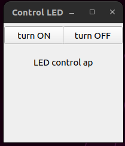

# PyQt5-LEDControll
## 1-Intro
Control an LED via button using PyQt5.



The led.py file contains function that discribes how configures the GPIO and set value for a raspberry PI.


## 2-Installing PyQt5:
```bash
  $pip install pyqt5
``` 
## 3-Clonnig repo:
```bash
  $git clone https://github.com/Onizuka09/PyQt5-LEDControll.git
``` 
## 4-Running the application : 
```bash
  $cd PyQt5-LEDControll
  $python3 app.py
```
## 5-Note 
To work with Raspberry pi 

- Uncomment these lines :

  ```python
      #f = open("/sys/class/gpio/export", "w")
      #s = open(f"/sys/class/gpio/export/gpio{PIN}/direction", "w")
      #f = open(f"/sys/class/gpio/export/gpio23/value", "w")
  ```

- Comment this line: 

  ```python
      f = open(f"gpio{PIN}", "w")
  ```
